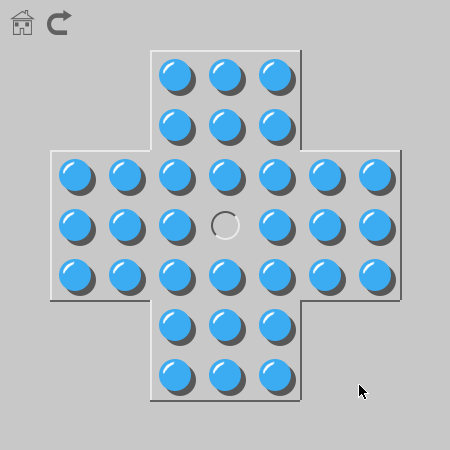

# Brainvita / Peg Solitaire clone
Everything works so have fun.

Requires pygame
```
pip3 install pygame
```
or
```
pip install pygame
```


 TODO:
- [x] Cool graphics
- [x] Cool Sound effects
- [x] Even more cool primitive gui
- [x] More levels
- [x] Hidden event
- [ ] Better winning screen
- [ ] Better music and more music
- [ ] More Crash Bandicoot
- [ ] More types of balls
- [ ] Time and scores
- [ ] Extra attractions for each theme.